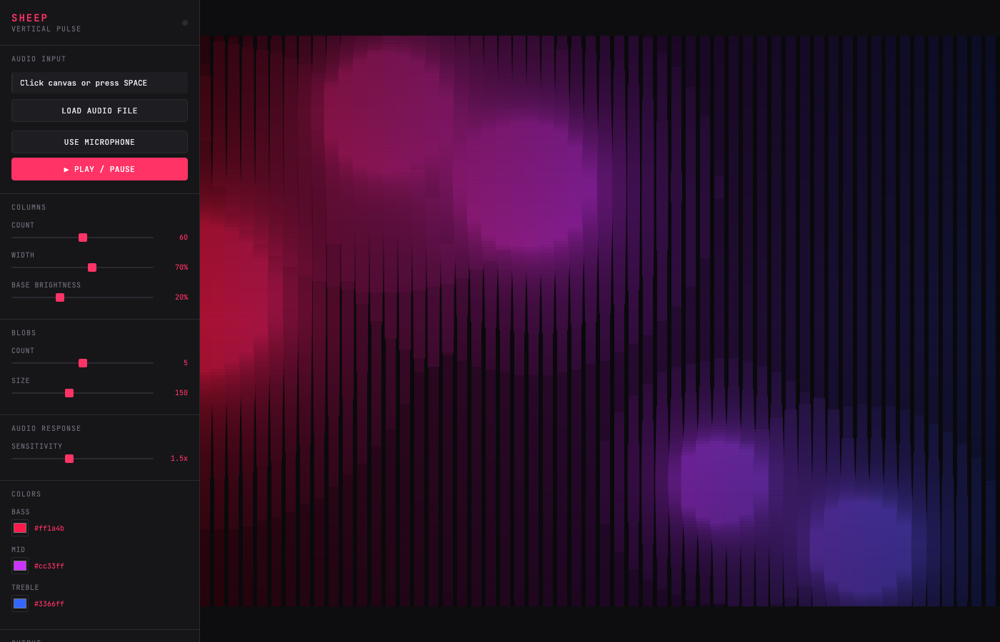

# Getting Started

Get sheep-viz running in under a minute.

## Quick Start (No Installation)

1. Open `visualizers/vertical-pulse-pro.html` in your browser
2. Click the canvas to enable audio
3. Load a track using the file picker
4. Enjoy the visuals

That's it. No npm, no build step, no configuration.

## Browser Requirements

- **Chrome** (recommended) - Best Web Audio and MIDI support
- **Firefox** - Full support
- **Safari** - Works, but MIDI may be limited
- **Edge** - Full support

## Audio Sources

### Local Audio File
Click "Choose File" and select any audio file (MP3, WAV, FLAC, OGG).

### Microphone/Line-In
1. Click "Use Mic" button
2. Grant microphone permission when prompted
3. Select your audio interface as the input device

This is useful for:
- Live performances with a mixer
- Reacting to system audio via loopback

## Basic Controls

| Key | Action |
|-----|--------|
| Space | Play / Pause |
| P | Pop out canvas (for dual-screen) |
| F | Toggle fullscreen |
| H | Hide / show UI |
| R | Start / stop recording |

## Switching Visualizers

Use the dropdown at the top of the sidebar to switch between different visualizers without reloading the page.

## Interface Overview

The interface is divided into:

1. **Canvas** - The visualization area (click to enable audio)
2. **Audio Controls** - File picker, mic input, play/pause
3. **Parameters** - Sliders to adjust the visual style
4. **Actions** - Fullscreen, record, preset management

## Next Steps

- [Live Performance Guide](live-performance.md) - Setting up for a show
- [Video Rendering](video-rendering.md) - Creating music videos
- [MIDI Setup](midi-setup.md) - Using a controller
- [Creating Visualizers](creating-visualizers.md) - Build your own
