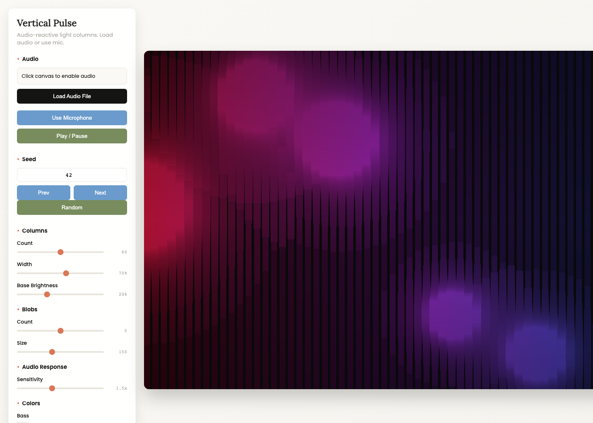
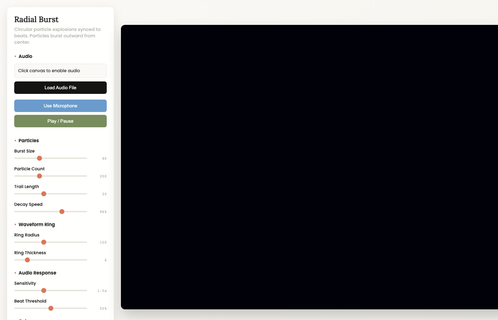

# Visualizers

sheep-viz includes multiple visualizer styles. Each reacts to audio in its own way.

## Vertical Pulse Pro

**File:** `visualizers/vertical-pulse-pro.html`

The flagship visualizer. Vertical light columns that breathe with frequency, distorted by organic metaball shapes.

### Features
- MIDI controller support
- Fullscreen projection mode
- Modern dark UI
- Real-time recording

### Parameters

| Parameter | Description | Range |
|-----------|-------------|-------|
| Column Count | Number of vertical bars | 20-100 |
| Column Width | Width of each bar | 1-20 |
| Noise Scale | Organic distortion amount | 0.001-0.05 |
| Blob Count | Number of metaball shapes | 1-10 |
| Blob Size | Size of distortion blobs | 50-300 |
| Color Shift | Hue rotation speed | 0-1 |
| Bass Boost | Low frequency emphasis | 1-5 |
| Mid Boost | Mid frequency emphasis | 1-5 |
| Treble Boost | High frequency emphasis | 1-5 |

### Audio Response
- **Bass** (20-250 Hz) - Affects left columns, overall intensity
- **Mids** (250-2000 Hz) - Affects center columns
- **Treble** (2000+ Hz) - Affects right columns, sparkle effects

---

## Vertical Pulse (Full)

**File:** `visualizers/vertical-pulse.html`

Extended version with overlay system and more features.

### Additional Features
- Overlay image support
- Overlay effects (split, pulse, glitch, cycle)
- Color extraction from images
- Resolution presets

### Overlay Effects

| Effect | Description |
|--------|-------------|
| Split | Image splits apart on beat |
| Pulse | Image scales with bass |
| Glitch | RGB shift and distortion |
| Cycle | Rotate through multiple images |

---

## Radial Burst

**File:** `visualizers/radial-burst.html`

Particles explode from the center on every beat. Trails decay into nothing. A waveform ring pulses around the chaos.

### Parameters

| Parameter | Description | Range |
|-----------|-------------|-------|
| Particle Count | Particles per burst | 10-100 |
| Particle Speed | Initial velocity | 1-20 |
| Trail Length | Fade duration | 0-1 |
| Ring Size | Waveform ring radius | 100-400 |
| Beat Threshold | Sensitivity for triggers | 0.1-0.9 |
| Gravity | Particle fall rate | 0-1 |
| Color Mode | Static, rainbow, or reactive | - |

### Audio Response
- **Beat Detection** - Triggers particle bursts
- **Waveform** - Draws as oscillating ring
- **Bass** - Controls burst intensity
- **Treble** - Affects particle color

---

## Choosing a Visualizer

| Use Case | Recommended |
|----------|-------------|
| Live performance | Vertical Pulse Pro |
| Music video with branding | Vertical Pulse (Full) |
| High-energy electronic | Radial Burst |
| Ambient/chill music | Vertical Pulse Pro (low settings) |

---

## Creating Your Own

See [Creating Visualizers](creating-visualizers.md) to build custom visualizers from scratch.
